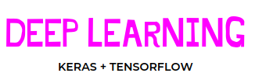

The purpose of this repository is my self practice of Deep Learning techniques. Exercises and Project used in the online course provided from Alura.

I am a student that is learning, let me know if you find any errors,the code is inspired from examples and exercises found in the course.

## Resources that I used to learn about this fun topic:
Online Course: Deep Learning part 1, Alura.
